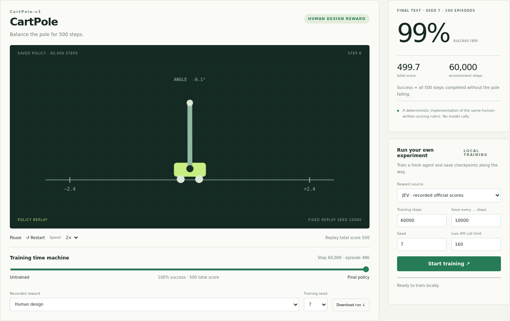
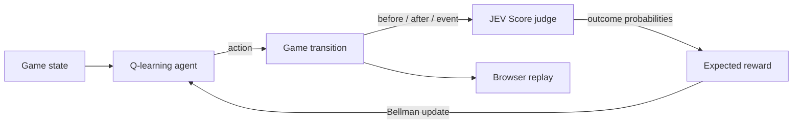

<div align="center">

# JevRL

[](https://jevrl.com/)
[](https://bringai.io/blog/jevrl)

**JEV Reinforcement Learning** · Let JEV judge. Let the agent learn.

A runnable reward-model laboratory: **CartPole, MountainCar, Acrobot, and
FrozenLake**, with neural DQN agents, official JEV scores, and saved game replays.

[简体中文](README.zh-CN.md) · [How it works](#how-it-works) · [Run it](#run-it) · [MIT](LICENSE)


**36 training runs · 3 seeds · 3 reward conditions · 3.24 million environment steps.**

**Recorded JEV API cost: ≈ $0.00241 (0.24 US cents).**

129 judgments, cached and reused across **12 JEV training runs / 1.08 million steps**.
This is the cost of building the four-game score cache; training compute and
development/diagnostic calls are excluded. [Cost records](experiments/jevrl-v1/judgments)

[Experiment records](experiments/jevrl-v1)

</div>

<!-- checkpoint-gallery:start -->
## Watch the policy learn

One game per column; one checkpoint per row. **JEV reward, training seed 7, replay seed 10000.** Complete episodes are time-compressed, including failed intermediate policies. DQN progress is measured in environment steps.

| Training stage | CartPole | MountainCar | Acrobot | FrozenLake |
|:--|:--:|:--:|:--:|:--:|
| **Untrained · 0 steps** | <br>0 steps · Not solved | <br>0 steps · Not solved | <br>0 steps · Not solved | <br>0 steps · Not solved |
| **10,000 steps** | <br>10,000 steps · Not solved | <br>10,000 steps · Success | <br>10,000 steps · Success | <br>10,000 steps · Not solved |
| **30,000 steps** | <br>30,000 steps · Not solved | <br>30,000 steps · Success | <br>30,000 steps · Not solved | <br>30,000 steps · Success |
| **Final policy** | <br>60,000 steps · Success | <br>120,000 steps · Success | <br>120,000 steps · Success | <br>60,000 steps · Success |

Each animation is one fixed rollout. The CartPole curve above shows mean total score (the game’s original cumulative score) across three training seeds.
<!-- checkpoint-gallery:end -->

Regenerate the gallery with `uv run --extra classic python scripts/homepage_media.py`.
This replays the saved actions, checks them against Gymnasium, and makes no model requests.
Regenerate the combined lead figure with `uv run python scripts/homepage_figure.py`.

## Four classic RL environments

| Official Gymnasium task | JEV final success | Total score | Steps / run |
|---|---:|---:|---:|
| CartPole-v1 | 100.0% ± 0.0% | 500.00 ± 0.00 | 60,000 |
| MountainCar-v0 | 94.7% ± 9.2% | −147.57 ± 9.29 | 120,000 |
| Acrobot-v1 | 77.3% ± 39.3% | −210.91 ± 201.86 | 120,000 |
| FrozenLake-v1, slippery 4×4 | 71.7% ± 2.3% | 0.717 ± 0.023 | 60,000 |

Mean ± sample SD across **three training seeds**, with 100 held-out test episodes
per policy. Human design reproduce the MountainCar and Acrobot results exactly
and match mean FrozenLake success. The abstractions and rubrics are human-designed;
these results demonstrate integration, not superiority over tuned RL baselines.

The homepage lets you switch game, reward source, seed, and saved checkpoint.
Official JEV answers are bundled: train against the recorded scores without an API
key, or explicitly choose live JEV. Policies save every 10,000 steps by default
(configurable). Development curves use separate seeds from the final test.



## What you get

The four-game suite above uses DQN. The original **Key Quest** tabular Q-learning
demo remains available at `/key-quest`:

- **A game to watch and play.** Collect a key, dodge lava, unlock the exit.
- **Actual reinforcement learning.** A Q table starts at zero and learns from judged moves.
- **A JEV reward adapter.** Official TypeSafe Score API, cached judgments, bounded retries,
  server-side credentials and an HTTP request budget.
- **An honest zero-key demo.** A deterministic rules judge exercises the entire pipeline.
  It is clearly labeled and is **not JEV**. Errors never silently switch providers.
- **A live dashboard.** Train, stop/save, inspect rewards, watch before/after replay,
  view the learning curve, play manually, and export JSON. Mobile controls included.
- **A training time machine.** Save policy weights, evaluation and replay every
  25 episodes (configurable); scrub through each stage of learning in the browser.
- **Reproducible artifacts.** Policy weights, metrics, judging evidence. Runs on CPU.

Independent of TypeSafe. The application is MIT-licensed; it does not redistribute
JEV weights or claim the hosted JEV model is open source.

## Run it

Python 3.10+ and [uv](https://docs.astral.sh/uv/) are sufficient. No GPU, Node.js or key needed.

```bash
git clone https://github.com/Bring-AI/jev-rl.git
cd jev-rl
uv sync --python 3.12 --extra classic
uv run --extra classic jev-arcade serve
```

Open **http://127.0.0.1:8000** and select a game. Drag **Training time machine** to
watch earlier policies. **JEV · recorded official scores** trains a new DQN using
the frozen actual API answers, with no new API charges. **JEV · live API** uses
your configured key. Training results are saved under `runs/classic/`.

The original manually playable Key Quest game is at `/key-quest` (arrow keys / WASD,
**R** to restart). `uv sync` without the classic extra still supports Key Quest and
recorded playback; training the four classic games requires the extra.

Without uv: create a Python virtual environment, install CPU PyTorch from its
official wheel index, then run `pip install -e '.[classic]'` and
`jev-arcade serve`. On a remote machine, forward the port with
`ssh -L 8000:127.0.0.1:8000 user@host`. Keep the server on localhost: this is a
trusted local application, not a multi-user authenticated service.

## Reproduce the classic experiment

The frozen official score tables are in `experiments/jevrl-v1/judgments`.
The benchmark uses them without credentials or paid requests:

```bash
uv run --extra classic python scripts/classic_benchmark.py run --output runs/jevrl-v1 --workers 8
uv run --extra classic python scripts/export_classic.py
```

To train just one game, using fresh JEV requests for unseen abstract transitions:

```bash
uv run --extra classic jev-arcade classic --game mountaincar --provider jev \
  --steps 120000 --checkpoint-steps 10000 --output runs/my-mountaincar
```

Choose `--provider rules` or `--provider native` for local controls. Add
`--cache experiments/jevrl-v1/judgments/mountaincar.json --frozen-cache` to use the
recorded official reward without a key. Each checkpoint has an SB3 model `.zip`
and evaluation/replay `.json`. Reload with `stable_baselines3.DQN.load(path)`.
These are policy/optimizer snapshots; the replay buffer is not saved for exact
training continuation. Existing completed output directories are never overwritten.

The score cache contains **129 retained answers**, with recorded construction cost
**$0.002409918**; this excludes training compute and development/diagnostic calls.
Reusing the frozen cache incurs no additional JEV API requests; live scoring of
uncached inputs does. All 1.08 million JEV-reward
steps in the main experiment reuse those answers. Native rewards never enter JEV
updates. The paper reports rubric disagreement, weak native baselines, and seed
variation explicitly. DQN's optimization loss is not a win-rate metric.

## Use real JEV

**OpenRouter hosts official TypeSafe JEV.** Use your existing OpenRouter key:

```bash
cp .env.example .env
# Edit .env locally and set OPENROUTER_API_KEY. Never commit credentials.
uv run --extra classic jev-arcade serve
```

Alternatively, set `OPENROUTER_API_KEY_FILE` to a local key file. Restart the server
and select **JEV · live API** in the classic suite. The original `/key-quest`
page calls this option **JEV · OpenRouter**. Train that Key Quest agent from the terminal:

```bash
uv run jev-arcade train --provider jev --episodes 350 --checkpoint-every 25 --max-calls 300 --output runs/jev
```

The default OpenRouter model is `typesafe/jev-1.13`, via
`https://openrouter.ai/api/v1/systemone` (the official System One compatibility
endpoint, not chat completions). `OPENROUTER_MODEL` and `OPENROUTER_BASE_URL`
can override those settings. The run records the actual served model, provider,
request IDs, token usage and reported cost.

Direct TypeSafe access also works: set `JEV_GATEWAY=typesafe` and `TYPESAFE_API_KEY`.
It defaults to `jev-latest` at `https://api.typesafe.ai/v1/systemone`.
`JEV_GATEWAY=auto` selects OpenRouter when its key or key-file setting is present,
otherwise TypeSafe. Credentials stay separate; neither gateway silently falls back
to the other. Remote custom endpoints require HTTPS.

The budget counts **every HTTP attempt, including retries**. Repeated transitions
reuse a judgment within the run. A key error, malformed answer or exhausted budget
stops training and saves partial results. Stopping waits for the current HTTP call,
cancels further retries, then saves. CLI Ctrl+C also saves. New runs use a new cache
and can incur new costs. JEV mode sends the documented game state to the endpoint.

**Validation status:** official JEV was called through OpenRouter in a complete
350-episode experiment. The measured model was `typesafe/jev-1.13-20260917`,
upstream provider `TypeSafe`. The rules provider remains a separate zero-key demo.


## How it works

The classic suite wraps official Gymnasium transitions, turns JEV's probability
distribution into a numerical reward, and trains an SB3 DQN. Its policy never
receives the judge's engineered transition features. Native reward is logged
separately for evaluation. The [reward implementation](src/jev_reward/classic/rewards.py) specifies all four rubrics.

The original Key Quest agent uses tabular Q-learning:



The policy sees `(x, y, has_key)` and chooses up/right/down/left via epsilon-greedy
Q-learning. **JEV judges the previous transition; it does not choose the next action.**
The environment returns facts and terminal status, never a numerical training reward.

The judge receives structured state: positions, key possession, event, and
**computed safe route distance to the next objective**. This engineered BFS feature
makes the experiment small and inspectable. The policy does not see the distance.
This is not pixel-based learning; the environment supplies substantial structure,
and a rules judge can solve this particular scoring task.

One Score question has six descriptive levels. Reward is their weighted expectation:

| Outcome | Reward weight |
|---|---:|
| Enter lava | −1.00 |
| Wall / locked exit / no progress | −0.15 |
| Move farther from objective | −0.12 |
| Move closer to objective | +0.08 |
| Collect key | +0.60 |
| Exit with key | +1.00 |

```text
r = Σ P(outcome = i) × weight[i]
Q(s,a) ← Q(s,a) + α [r + γ max_a′ Q(s′,a′) − Q(s,a)]
```

Terminal lava/win transitions use zero bootstrap. Time-limit truncation bootstraps
because it is a training cutoff, not a terminal game state. There is **no added
environment reward, success bonus or hidden imitation policy**. Confidence is shown
as metadata, not treated as a correctness guarantee. Prompts, weights, updates and
game rules are small, readable files.

## Reproduce the experiment

```bash
uv run jev-arcade train --provider jev --episodes 350 --seed 7 --checkpoint-every 25 --output runs/jev
uv run python scripts/plot_run.py --run runs/jev/run.json --output assets/training.png
# Or run the separate free rules demo:
uv run jev-arcade train --provider demo --episodes 350 --seed 7 --output runs/demo
```

Measured with the committed configuration:

| Metric | Before | After |
|---|---:|---:|
| Success, 60 evaluation episodes | 3.33% | 100% |
| Mean episode length | 23.65 | 11.80 |

Provider: **official JEV via OpenRouter**, 153 API calls, 5655 cache hits,
89,819 input tokens, 2,601 output tokens, **$0.003772398** reported API cost.
The separate rules demo achieved the same final figures with zero API calls.
Evaluation uses seeds 10000–10059, zero exploration, and the same fixed map;
ties break randomly with the evaluation seed. This is a same-map sanity check,
not an unseen-level benchmark or a broad claim about JEV's game reasoning. Evaluation never calls
the judge; replays attach cached training evidence when available.

```text
runs/<run-id>/
  run.json        # config, provenance, metrics, history and replays
  policy.json     # Q table and game/config metadata
  judgments.json  # scoring question, observed transitions, verdicts
  checkpoints/
    episode-00000.json  # initial Q table, evaluation and replay
    episode-00025.json  # policy after 25 completed training episodes
    ...
    episode-00350.json  # final policy, evaluation and replay
```

Browser runs use separate IDs. The CLI overwrites the selected output directory;
change `--output` to retain another run. Stopped runs keep completed episode metrics;
the policy also includes updates from the incomplete episode.

The browser's **Training time machine** slider selects a checkpoint and plays
that policy on the same evaluation seed. The save interval is configurable in the
UI or through `--checkpoint-every`. Each checkpoint includes the full Q table,
60-game evaluation and replay; checkpoint evaluation makes **no extra API calls**
and does not change the training RNG. Interrupted final snapshots are marked partial.
The run JSON also contains the timeline, so static exports and downloaded runs retain it.

The homepage figure shows **episode return**, **evaluation win rate**, and
**training win/lava/timeout counts**. There is no supervised `test loss` in tabular
Q-learning. Evaluation win rate answers whether the saved policy actually wins;
training outcomes remain noisier because the agent is exploring.

## Share a replay

```bash
uv run python scripts/export_site.py --run runs/demo/run.json --output dist/site
python3 -m http.server 8080 --directory dist/site
```

Open http://127.0.0.1:8080. The static site includes game, manual controls, charts and
recorded replay. Training is disabled; no credentials are included.
CI and Pages workflow templates are in [docs/workflows](docs/workflows).
They are not installed or running. Installing them under `.github/workflows`
requires a GitHub credential with `workflow` scope. The live demo is hosted at
[jevrl.com](https://jevrl.com/). For an alternative Pages deployment,
enable Pages with GitHub Actions and run the Pages template manually; it refuses
private repositories. Live training runs on the Python server.

## Docker

```bash
docker build -t jev-reward-arcade .
docker run --rm -p 127.0.0.1:8000:8000 jev-reward-arcade
# Optional real JEV; .env stays outside the image:
docker run --rm --env-file .env -p 127.0.0.1:8000:8000 jev-reward-arcade
```

The container uses an unprivileged user. Export a run through the UI to retain it
after an ephemeral container exits.

## Development

```bash
uv run pytest -q
uv run ruff check .
uv run ruff format --check .
uv build
uv run playwright install chromium
# With the server running in another terminal:
uv run python scripts/browser_smoke.py
```

Tests cover game mechanics, Bellman updates, reward isolation, learning improvement,
API contract/cache/budget/errors, interruption saves, server lifecycle, browser
training/replay/manual play/export, and mobile layout. See [CONTRIBUTING.md](CONTRIBUTING.md).

## References

- [Awesome JEV Gallery](https://github.com/OmniJev/awesome-jev-gallery): the inspiration.
- [TypeSafe quick start](https://docs.typesafe.ai/introduction/quickstart): endpoint and authentication.
- [Score primitive](https://docs.typesafe.ai/primitives/score): levels and probability responses.
- [OpenRouter System One integration](https://openrouter.ai/docs/guides/community/typesafe-sdk): official JEV routing.
- [JEV limitations](https://docs.typesafe.ai/model-jaggedness/jev-1.13): judgments need empirical evaluation.
