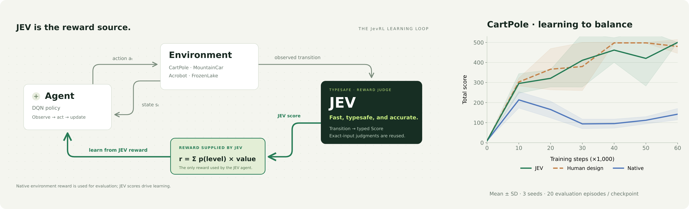
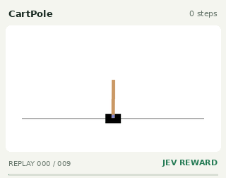
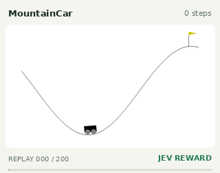
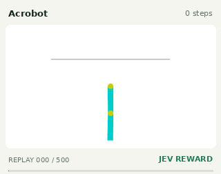
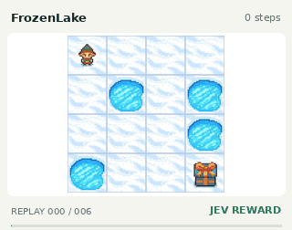
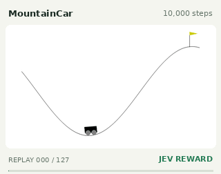
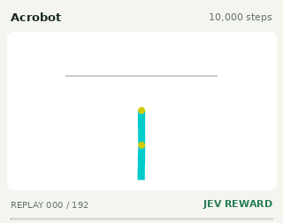
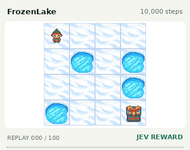
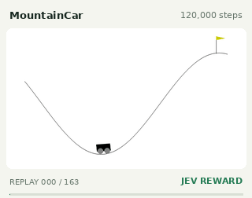
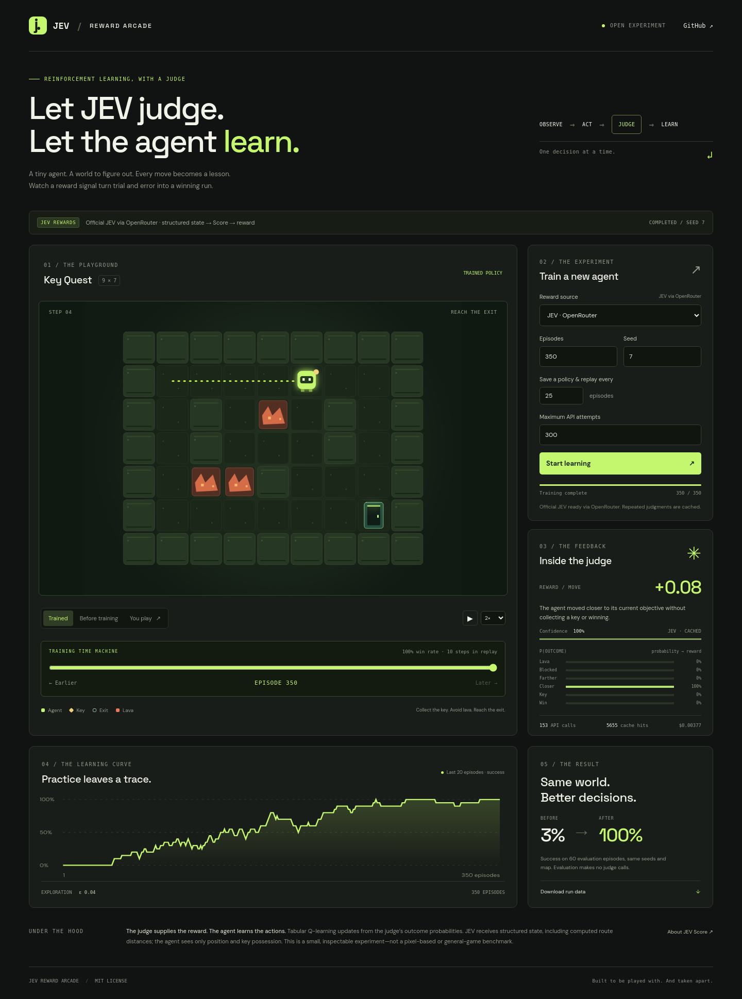

# JevRL

[](https://jevrl.com/)

**让 JEV 当裁判，让强化学习智能体学会玩游戏。**

[English](README.md) · [MIT 开源协议](LICENSE)




<!-- checkpoint-gallery:start -->
## 看见策略如何学会玩游戏

每列一个游戏，每行一个训练阶段。使用 **JEV reward、训练种子 7、回放种子 10000**；展示完整局并压缩播放时间，保留中间失败。DQN 用真实环境步数记录训练进度。

| 训练阶段 | CartPole | MountainCar | Acrobot | FrozenLake |
|:--|:--:|:--:|:--:|:--:|
| **未训练 · 0 步** | <br>0 steps · 未通关 | <br>0 steps · 未通关 | <br>0 steps · 未通关 | <br>0 steps · 未通关 |
| **10,000 步** | <br>10,000 steps · 未通关 | <br>10,000 steps · 成功 | <br>10,000 steps · 成功 | <br>10,000 steps · 未通关 |
| **30,000 步** | <br>30,000 steps · 未通关 | <br>30,000 steps · 成功 | <br>30,000 steps · 未通关 | <br>30,000 steps · 成功 |
| **最终策略** | <br>60,000 steps · 成功 | <br>120,000 steps · 成功 | <br>120,000 steps · 成功 | <br>60,000 steps · 成功 |

动图是固定单局回放；上图 CartPole 曲线为三个训练种子的 Total score（游戏原始累计得分）均值。
<!-- checkpoint-gallery:end -->

运行 `uv run --extra classic python scripts/homepage_media.py` 可重新生成全部动图；
它会核对 Gymnasium 回放与原始记录，不产生新的模型请求。

已接入 **CartPole、MountainCar、Acrobot、FrozenLake** 四个 Gymnasium 经典环境，
使用 DQN 神经网络策略；原来的 Key Quest 也保留。

**36 组训练、3 个随机种子、3 种奖励条件，共 324 万环境步。**
[实验原始指标](experiments/jevrl-v1)

| 游戏 | JEV 最终成功率（均值 ± 种子间标准差） | 每组训练步数 |
|---|---:|---:|
| CartPole | 100.0% ± 0.0% | 60,000 |
| MountainCar | 94.7% ± 9.2% | 120,000 |
| Acrobot | 77.3% ± 39.3% | 120,000 |
| FrozenLake（有打滑） | 71.7% ± 2.3% | 60,000 |

每个种子用 100 局独立最终测试评估。Human design（人工设计奖励）对照在 MountainCar 和 Acrobot 上与
JEV 结果完全一致，在 FrozenLake 上平均成功率相同。评分特征与规则由人设计，
不把奖励设计的效果全部归因于模型；论文也保留了失败种子和评分错误案例。

原来的 Key Quest 是一个普通 CPU 就能跑的完整实验：智能体拿钥匙、躲熔岩、到出口；
JEV 对每次状态变化评分，评分转换成奖励，Q-learning 据此学习。
网页展示训练曲线、每步奖励、概率分布和训练前后回放，你也可以亲自玩。
项目独立于 TypeSafe，代码使用 MIT 协议，不包含官方 JEV 权重。

## 启动

安装 [uv](https://docs.astral.sh/uv/) 后：

```bash
git clone https://github.com/Bring-AI/jev-rl-reward.git
cd jev-rl-reward
uv sync --python 3.12 --extra classic
uv run --extra classic jev-arcade serve
```

打开 **http://127.0.0.1:8000**，选择游戏、奖励来源和训练种子，拖动滑块看保存点。
默认每 10,000 步保存一次神经网络模型与回放，可修改间隔。
选择 **JEV · recorded official scores** 可用已记录的官方评分训练新策略，不需要 key；
选择 **JEV · live API** 才会使用配置好的 key 请求官方服务。

四游戏对照实验复现：

```bash
uv run --extra classic python scripts/classic_benchmark.py run --output runs/jevrl-v1 --workers 8
uv run --extra classic python scripts/export_classic.py
```

正式实验使用 129 条冻结的官方评分，记录的构建成本约 $0.00241（不含开发诊断请求）。
JEV 模式的 108 万训练步全部复用这些评分，没有混入环境原生奖励。
训练 reward、原生得分、成功率分开显示；这里不用监督学习的 test loss 衡量输赢。

原来的 Key Quest 在 **http://127.0.0.1:8000/key-quest**，仍支持手动玩和每 25 局保存：

- **Trained**：训练后策略回放。
- **Before training**：初始策略回放。
- **You play**：方向键 / WASD 操作，R 重开，手机有触屏按钮。
- **Stop & save progress**：停止并保存。
- **Download run data**：下载实验记录。
- **Training time machine**：拖动滑块，观看第 0、25、50……局的策略如何玩。

远程机器可用 `ssh -L 8000:127.0.0.1:8000 user@host` 转发端口。
这是本地实验服务，不带多用户鉴权，请保持 localhost 绑定。

## 使用真实 JEV

**OpenRouter 已提供 TypeSafe 官方 JEV，可以直接用 OpenRouter key：**

```bash
cp .env.example .env
# 在 .env 中填写 OPENROUTER_API_KEY，不要提交这个文件。
uv run jev-arcade serve
```

也可以用 `OPENROUTER_API_KEY_FILE` 指定本地密钥文件。
重启后选择 **JEV · OpenRouter**。也可以直接训练：

```bash
uv run jev-arcade train --provider jev --episodes 350 --checkpoint-every 25 --max-calls 300 --output runs/jev
```

OpenRouter 默认模型为 `typesafe/jev-1.13`，接口为
`https://openrouter.ai/api/v1/systemone`，使用它的官方 System One 兼容接口。
每次判断保留实际模型版本、服务商、请求 ID、token 用量和费用。
也支持 TypeSafe 直连：设置 `JEV_GATEWAY=typesafe` 与 `TYPESAFE_API_KEY`。
默认 `auto` 在配置 OpenRouter 凭据时优先用 OpenRouter，否则使用 TypeSafe。
两个平台的凭据分别配置，均可调用官方 JEV，不会失败后悄悄切换平台。

重复状态变化会缓存；300 次上限指实际 HTTP 尝试次数，包含重试。
新训练不继承缓存。接口报错、格式异常、预算耗尽都会停止并保存，
不会偷偷改用规则评分。停止会等待当前网络调用结束，取消重试并保存；
CLI 按 Ctrl+C 也会保存。

## 原始 Key Quest：奖励如何训练智能体

```text
游戏状态 → Q-learning 选择动作 → 状态变化
    ↑                           ↓
策略更新 ← 奖励期望值 ← JEV 概率评分
```

策略只看 `(x, y, 是否拿到钥匙)`。JEV 评价上一步，不选择下一步。
环境只返回事实和终止标记，不提供数值奖励；训练奖励完全来自 judge。

JEV 看**结构化状态，不看截图**。输入包含坐标、钥匙、事件，以及由 BFS
计算的安全路径距离。这个人工设计的特征使实验容易复现，也意味着这项
评分任务本身可由规则解决，不能据此证明 JEV 具备复杂游戏推理能力。

六个等级对应：熔岩 −1，受阻 −0.15，远离目标 −0.12，接近目标 +0.08，
拿钥匙 +0.6，获胜 +1。奖励为 `Σ P(等级) × 对应奖励`，
不混入环境成功分、额外胜利奖励或预设行动路线。

## 原始 Key Quest：实测结果与边界

```bash
uv run jev-arcade train --provider jev --episodes 350 --seed 7 --checkpoint-every 25 --output runs/jev
uv run python scripts/plot_run.py --run runs/jev/run.json --output assets/training.png
```

| 指标 | 训练前 | 训练后 |
|---|---:|---:|
| 60 局评估成功率 | 3.33% | 100% |
| 平均局长 | 23.65 步 | 11.80 步 |

**这些成绩来自真实官方 JEV**：实际模型 `typesafe/jev-1.13-20260917`，
上游提供方 TypeSafe，经 OpenRouter 路由。153 次请求、5655 次缓存命中，
报告费用 $0.003772398。独立的免费规则演示最终取得相同成绩。

评估使用相同地图、固定种子 10000–10059，不探索，价值相同时按种子随机
打破平局。评估不调用 judge，不产生 API 开销。这不是未见地图泛化测试。

训练保存 `run.json`、`policy.json`、`judgments.json`，分别包含结果与回放、
Q 表、评分证据。网页每次使用独立目录；CLI 会覆盖指定输出目录，
保留不同实验请更换 `--output`。停止时完整局统计和部分局的策略更新都会保留。

默认每 **25 局**保存一个 `checkpoints/episode-xxxxx.json`，包含完整 Q 表、
60 局评估和该阶段回放。保存间隔可在网页或 `--checkpoint-every` 修改。
滑块可以切换任意保存点，用同一评估种子对比；阶段评估不消耗额外 API 请求，
也不会改变训练的随机数序列。中断时的末尾快照会标记 partial。

首页图展示 **每局奖励 reward、阶段评估胜率 win rate、训练时的获胜/熔岩/超时数量**。
表格 Q-learning 没有监督学习意义上的 test loss；看评估胜率更能反映是否学会赢。
训练局包含探索，所以即便评估已会赢，训练过程中仍可能失败。



## 静态展示与校验

```bash
uv run python scripts/export_site.py --run runs/demo/run.json
python3 -m http.server 8080 --directory dist/site
uv run pytest -q
uv run ruff check .
uv run ruff format --check .
uv build
```

静态站点保留回放、图表和手动游戏，训练按钮禁用。
CI 和 Pages 配置保留在 [docs/workflows](docs/workflows) 作为模板，当前未启用。
在线演示位于 [jevrl.com](https://jevrl.com/)。如需另行部署到 Pages，可用带 `workflow` 权限的 GitHub 凭据将模板安装到
`.github/workflows`，再手动启用 Pages。Pages 模板拒绝对私有仓库部署。
实时训练使用 Python 服务。
Docker 和浏览器测试见 [英文文档](README.md)。

灵感：[Awesome JEV Gallery](https://github.com/OmniJev/awesome-jev-gallery)。
接口：[TypeSafe Score 官方文档](https://docs.typesafe.ai/primitives/score)。
